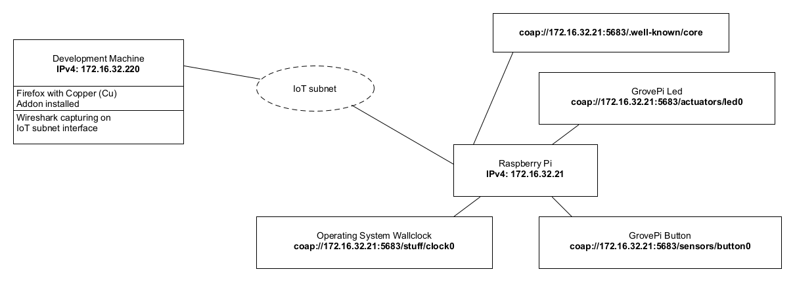
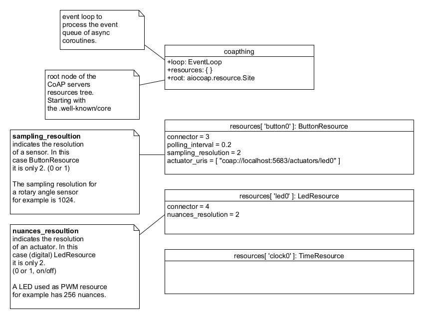
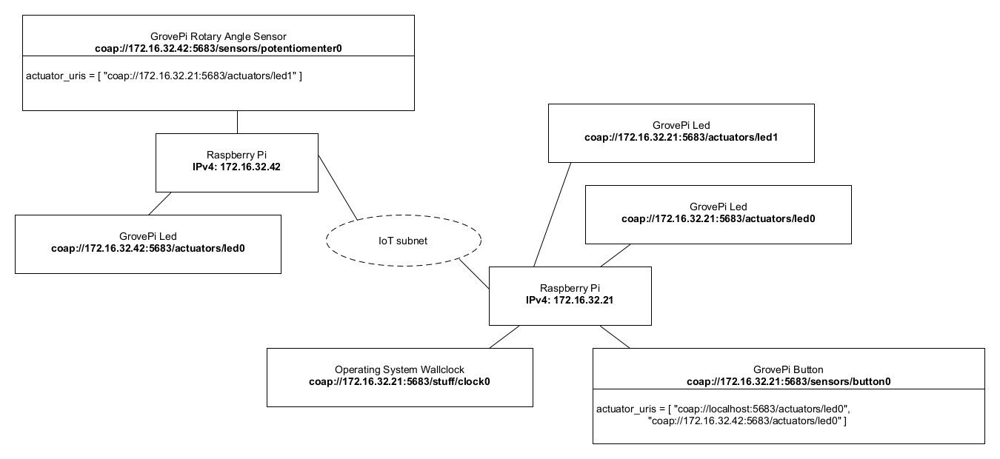

# 02 - CoAP

## 1. Introduction

This laboratory concentrates on CoAP. An exemplarily device (“thing”) will be implemented. The device manages some sensors and actuators and uses CoAP as protocol to communicate with itself or remote devices (“things”). As device the Raspberry Pi is used. The sensors and actuators are represented by the GrovePi board and its resources (button, led, rotary angle sensor, etc.).

Further on this laboratory covers also a closer look at the CoAP communication messages.

The developed code during this laboratory can later on serve as a basis for upcoming projects during the lab lessons. Be sure not to delete it before the course is at it's end.

## 2. Learning Aims
There are no learning aims associated with this laboratory exercise.

## 3. Prerequisites
1. Raspberry Pi device (with MAC address labeled around the Ethernet port)
1.1 [micro]SD card with at least 8 GB capacity
1.2 Raspberry Pi Power supply
2. 1 GrovePi board
3. 1 GrovePi Button
4. 1 GrovePi LED (colour indifferent)
5. 1 computer (your own laptop or a lab machine)
5.1 Ethernet port  
5.2 SSH client installed (ssh, PuTTY, …)  
5.3 Mozilla Firefox / Google Chrome / Chromium
5.3.1 Copper (Cu) Firefox Addon
5.4 Wireshark (Network packet capturing software)
5.5 Zip software (7-zip, WinZip, …)
5.6	Editor of your choice for modifying the code base.

## 4. Getting started

### 4.1 A few words of introduction

This laboratory has been developed and tested on a Linux machine. In principal it should work fine on Mac OS X and Windows too. Should you run into problems with the libraries or scripts provided with this laboratory it is maybe worth trying to use a Linux VM on your laptops host system in order to complete all the demanded tasks.

### 4.2 Preparation of the hardware

Connect the GrovePi board to your Raspberry Pi, then connect a GrovePi LED to the digital pin D4 and a GrovePi button to the digital pin D3. Make sure that the Raspberry Pi and your development machine are connected to the IoT subnet. As mentioned earlier, it is a good idea to turn off all the other network adapters (WLAN, …) on your development machine during the lab. If you are connected to the IoT subnet you should have connectivity to the “internet”.


### 4.3 Installation of the required packages (already installed)

It is assumed that you have completed the previous laboratory. Due to that you should have a [micro]SD card with a working Raspbian operating system on it with all the necessary packages installed to interact with the GrovePi board and its resources.

Start up your Raspberry Pi and log in as pi user via a SSH client of your choice.

The packages which delivers the ability to talk CoAP requires Python with a version number >= 3.4.x. Python3 is already part of the Raspbian installation on your [micro]SD card but we have to tell python3 about the installed GrovePi packages. Otherwise it will fail to **import grovepi**.

This is realized by invoking the following commands:
* `cd /home/pi/repos/GrovePi/Software/Python/`
* `sudo python3 setup.py install`

Further on, the aiocoap library (on which the coapthing application is based on) requires the Link Header package. It can be installed via the python package manager pip:

* `sudo pip3 install LinkHeader`

### 4.4 Upload and test the provided code template

Upload the archive that contains the code template (**CoAP_thing-0.2-dbg.zip**) which is provided with this documentation to your Raspberry Pi and unzip it.
After that you should see a folder named **CoAP_thing**. Change into the **CoAP_thing/src/** directory, where the following files can be found:

```bash
-rw-r--r-- 1 pi pi 3356 Sep 30 18:23 Actuator.py
-rw-r--r-- 1 pi pi 4089 Sep 30 18:23 ButtonResource.py
-rw-r--r-- 1 pi pi 3642 Sep 30 18:23 coapthing.py
-rw-r--r-- 1 pi pi 4246 Sep 30 18:23 LedResource.py
-rw-r--r-- 1 pi pi 1284 Sep 30 18:23 log.py
-rw-r--r-- 1 pi pi 2740 Sep 30 18:23 Sensor.py
-rw-r--r-- 1 pi pi 2364 Sep 30 18:23 TimeResource.py
```

The program entry point is located in the module **coapthing.py**.

Start the program: `python3 ./coapthing.py`

The application uses a python logger which is configured to be very verbose since the application is in a development state. Do not be concerned about if your console gets spammed with log messages during the application runs.

To test the functionality of the application it is sufficient for now to test if the connected LED turns on as long as the connected button is pressed and switches off again if the button is released.

The program can be terminated by pressing **Ctrl + C**.

### 4.5 Browse CoAP resources:
In order to browse CoAP resources, there is exist browser extensions to do so:

#### 4.5.1 Firefox and the Copper (Cu) addon

Due to that fact, a Firefox version prior 56 has to be used, for sending / receiving CoAP messages through a web browser. One finds a portable version of Firefox with a pre-installed Copper addon. The benefit of the portable version is, that it doesn’t affect already installed Firefox versions.

Unfortunately there is only a portable version for MS Windows operating systems yet. Users of unixoid systems could use a virtual machine or tools like wine, to run the portable Firefox version.

The portable version of Firefox can be found at:

Server/Host: **jupiter.lab.iot (ftp://jupiter.lab.iot)**  
User: **iotro**  
Password: **iotro**  
Location on FTP server: **/shared/IoT/p2**

To check if your Firefox browser supports CoAP visit: **coap://coap.me:5683**  

The Copper GUI should be displayed and show some resources on the left side.


## 5. Analysis of the CoAP protocol

### 5.1 First CoAP request

* If you sucessfully started the CoAP_thing application earlier in this laboratory, log in to
your Raspberry Pi and start the application again.
* Start Wireshark on your development machine and capture your LAN interface which is
connected to the IoT subnet.
  * If there is to much traffic on that line, write **coap** in the filter field in order
to hide all the other traffic.
* Open the program Firefox or Chrome/Chromium on your development machine and visit the
following place (with Chrome you’ll have to enter the URL after clicking the Cu extension
icon on top right):
**coap://<ipv4.of.your.raspberrypi>:5683/**
* Press Discover on the Copper GUI.
This will invoke a GET request to the path **.well-known/core** on the CoAP server.
**.well-known/core** is a special path which is available on all CoAP servers and it is used
for resource detection. In the following illustration, the IP addresses are only exemplary.



* The server should have responded with a list of all his resources. There are some specialties
to note here. CoAP uses a so called piggyback acknowledgment. As you can see in the
Wireshark capture the client (Copper) uses a confirmable packet (CON) for the request
which tells the server that it must send an acknowledgment message. To save bandwidth the
server tries to combine the ACK and the answer message.
* Another important thing is the response code. CoAP uses, like HTML, response codes to
indicate whether a request has succeeded or if it has failed. Check
[https://tools.ietf.org/html/rfc7252#page-48](https://tools.ietf.org/html/rfc7252#page-48) to get a list of possible response codes.

#### 5.1.1 Your tasks

* Create a solutions folder: **IoT_<DATE_ISO8601>\_lab2_\<name>**
* Place the capture of the GET request and the answer to it in a sub folder **captures** (name it
in a sensible way). You can export specific packets like this:
  * Add a filter expression for the type of packets you want, e.g. **coap**
  * Check if the capturing process is stopped.
  * Edit → Mark All Displayed Packets
  * File → Export Specified Packets.
    * Packet Range: Marked Packets only
* Try to find out how the the answer to the confirmable GET request is structured.

### 5.2 CoAP in deep
The basic procedure to connect to a device which is able to process CoAP requests (Raspberry Pi
with running CoAP_thing application) should now be clear. Our client to connect to the device is
the Firefox browser with the Copper (Cu) addon installed.
To get more familiar with the Copper addon feel free to test its functionalities e.g.:
* Observe the button and see if you can watch its changing value while the button is pressed
on the device.
* Try to turn on / switch off the LED on the device by sending **put requests** to the CoAP
server on the Raspberry Pi. Fill out the request payload in the outgoing tab and send a put
request. (Valid payload for the LED would be: **True** [On] or **False** [Off])

#### 5.2.1 Your tasks
* Start Wireshark to capture on the interface which is connected to the IoT subnet.
* Run the CoAP_thing application on the Raspberry Pi and connect to it via
Firefox Copper (Cu) addon: coap://<ipv4.of.your.raspberrypi>:5683/
* Use the Discover button to discover the resources of the server.
* Write a get request to /.well-known/core
(On the Copper GUI click on the core resource and then click GET)
* Is there any difference in the behavior or the packet content, if so which?
Export the two transfers to your capture Folder.
(And do this for all the following requests and answers)
* There is also a ping button on the Copper GUI. Test it out and check with Wireshark what
kind of packet is used. Is there e special ping packet/flag?
* We have already captured the get GET command. Try the other 3 REST commands (POST,
PUT, DELETE) on the button and the LED resource. Not all commands are implemented on
all resources. Which are implemented where? If a request fails note it to your answer sheet with the error code.
* While examining you may have noticed that the LED implements only the PUT method.
What response code do you get when requesting with a valid payload (True or False)? Send
the same requests consecutively and check the response code. Also send PUT request with
invalid payload and see what response code is returned now. Does the returned error code
support content?
  * We chose to use PUT over POST as our 'update' method. Do you agree with that choice?
Wouldn't POST have been better? Should we implement both, as they should behave the
same, or what should be the difference in your opinion?
* The last and probably most important CoAP command is the observe command. Try to
observe the button resource and see whats happening if the button is pressed.
  * Is it a CON or a NON message. Is this a good way to answer to an observe command?
Why does the Server answer this way? Name at least one scenario each, where CON or
NON messages are desirable.
* In the behaviour tab a lot of additional options for the packets can be specified. Test them.
Write down what you have tested and if you found something interesting.

#### 5.2.2 Known Bugs / Errata

When working with non confirmable messages and using the coapthing application as “server”,
then an ACK is returned from the server. This behavior is wrong and results due to a bug in the
aiocoap library (v-0.2).


_Wrong behavior of NON confirmable CoAP messages._

The correct behavior, tested against **coap://coap.me:5683** would look like:


_Correct behavior of NON confirmable CoAP messages._

---

## 6. The CoAP_thing application

In this chapter the application which was uploaded to the Raspberry Pi and then used to perform the
tasks in the CoAP analysis chapter is now going to be examined in a more detailed manner.

If one is more familiar with the application and the use of the aiocoap package, the application can
be extended and resources (sensors/actuators) across the IoT subnet can be applied. The aim is that
the devices (Raspberry Pis) are able to exchange data supplied through the CoAP protocol.


### 6.1 Study the architecture

The application is entirely written in Python (version 3.4.2). The implementation of CoAP is
provided by the aiocoap package. In general the implementation of CoAP_thing uses object
orientation, but it was decided to stay in a pragmatic scope and not to exaggerate the object
orientation.

#### 6.1.1 aiocoap - The Python CoAP library

The aiocoap package is a Python implementation of CoAP, the Constrained Application Protocol
(RFC 7252, more info at [http://coap.technology/](http://coap.technology/)).

It uses the asyncio module introduced in Python 3.4 to facilitate concurrent operations while
maintaining a simple to use interface and not depending on anything outside the standard library.

Source: [https://github.com/chrysn/aiocoap](https://github.com/chrysn/aiocoap)

If further code examples or informations are needed, refer to the aiocoap documentation which can
be found at: [http://aiocoap.readthedocs.io/en/latest/](http://aiocoap.readthedocs.io/en/latest/)

**Concept of coroutines**

As mentioned earlier, aiocoap uses coroutines instead of e.g. threads to manage concurrent
instructions. To solve all the tasks within this laboratory it should be sufficient to consult the code of
the CoAP_thing template, to get it all managed with async coroutines.

Since this is not mainly a Python course but if you still want to gain a profound understanding of
asynchronous I/O, event loop, coroutines and tasks, the documentation of Python's asyncio package
is located at:  
[https://docs.python.org/3.4/library/asyncio.html](https://docs.python.org/3.4/library/asyncio.html)

A revealing depiction with a sequence diagram of a very basic coroutine implementation can be
found at:  
[https://docs.python.org/3.4/library/asyncio-task.html#example-chain-coroutines](https://docs.python.org/3.4/library/asyncio-task.html#example-chain-coroutines)

#### 6.1.2 Basic concept

The CoAP_thing application consists of a main module, coapthing, which represents a CoAP
server. The server itself provides resources (sensors and actuators) which can be reached, observerd
and modified via a CoAP URI, e.g.: **coap://<ipv4.of.raspberry.pi>:5683/actuators/led0**

The basic CoAP_thing template consists of a CoAP server with the following resources (all **observable**):

* **button0**: GrovePi Button
* **led0**: GrovePi LED
* **clock0**: Resource which gets the operating system's time and serves it to the requester.

The resources have the following class structure:


This class diagram shows only the most important functions / instance variables at current classes.

**Key Points of the application regarding CoAP**

PUT requests are sent when actuators are getting notified. Check out the code of the method
notify_actuator in the ButtonResource and the Sensor class. The payload of the sensor value is
encoded as ASCII characters before sending (This makes it easier to interpret when capturing CoAP
messages).

The PUT requests are processed on the actuator side within the **render_put** method.

GET requests on the Sensor as well on the Actuator side are processed within the **render_get**
method. See classes Sensor, LedResource for example.

All the other CoAP mechanisms (observe, discover, …) are handled by the aiocoap library. As you
can see, we derive all our classes from the ObservableResource class from the aiocoap.resource
package.

#### 6.1.3 Object diagram

The following object diagram illustrates the CoAP_thing server in its running state:



This trivial server implementation has one button which has only one actuator to notify. In this case
the actuator is located on the same machine as the sensor (localhost).

#### 6.1.4 Network situation


The IP addresses are only exemplary!

### 6.2 Expand the application

Now after getting a first glance, the basic concept of the CoAP_thing application should be
understood. For this task at least 2 Raspberry Pi's are needed. Therefore you should work in goups
of two or three.

To start and see if the CoAP_thing application also works spreaded over a network, it is
recommended that a very simple network scenario is implemented first.

#### 6.2.1 Scenario: 2 RPi's, 1 button, 2 LED's

Try to extend the application to achieve the following situation:


The IP addresses are only exemplary!

If everything was adjusted the right way, the LED's on both Raspberry Pi should light up when the
button is pressed and switch off when the button is released again.

#### 6.2.2 Scenario: 2 RPi's, 1 button, 1 rotary angle sensor, 3 LED's

It is not mandatory to implement exactly this scenario. This is just a proposal. You are free to
choose and implement every sensor/actuator that is available in the laboratory. The only condition is
that your distributed application is somewhat more sophisticated than the one in the previous
scenario.



The IP addresses are only exemplary!

Additional to the previos scenario a rotary angle sensor and another LED were connected to the
GrovePi boards here. The rotary angle sensor should dim the LED. (Remember the first laboratory,
example GrovePi Python scripts.)

But now the sensor values have to be transferred over the network. Try to implement the resources
and think about how this could be done and which values have to be transmitted.

---


## 7. Prepare your own IoT project

In the last laboratories of this course you will have the task to write your own IoT application. This
means you will implement a client/server application on your Raspberry Pi similar to the
CoAP_thing application we have just worked with. The communication of the application parts has
to be realized with the lightweight protocols CoAP or MQTT (see later laboratory). The application
should announce its resources to the world (like our CoAP_thing) and also run some logic to use its
actuators for a meaningful application. You can also use a database if you want to e.g. record sensor
data and derive some statistic plots at a given time. A later laboratory covers the setup and basic
commands of a distributed data base system. You will have the chance to order additional special
sensors/actuators for your project.

Basically the IoT project is meant to be realized in groups with 2 – 3 members.

### 7.1 Your tasks

* Think of an application for your Raspberry Pi. It will need to meet the following criteria:
  * Usage of local sensors
  * Publication of all your Resources via a protocol (CoAP or MQTT)
(Except you have valid reasons not to do that. [Privacy])
  * Usage of remote sensors (the application consitst of at least 3 Raspberry Pis)
* Additional Points
  * Usage of complex Sensors Cameras etc. (Keep in mind that you will only have 4-8h to
complete the Task don't over do it).
  * Usage of a Database (at least a file system)
* Clever usage of database values. (database design)
  * Usage of global sensors (not from within the IoT class)
(only if there is a reason to use them)
  * Usage of hybrid technologies like using additional protocols like HTTP proxies, etc.
* Until next laboratory:
  * Have a broad concept of what you want to do
  * Check the stock in the IoT laboratory room if you find all the sensors/actuators you
require for your own project. If you can’t find all the material, then check
[https://www.pi-shop.ch/](https://www.pi-shop.ch/) for sensors/actuators (GrovePi) you will need to
accomplish that concept. **Also check the availability of the items you want to have
ordered (sometimes delivery times may exceed the end of the semester)!**
  * Inform your lecturer about your concept and what sensors/actuators you need to
materialize your idea. Also where they are going to be set up. Maybe some
devices/sensors/actuators can be shared within the IoT class.

## 8. Grading

3 points maximum will be awarded for completion of the exercises.