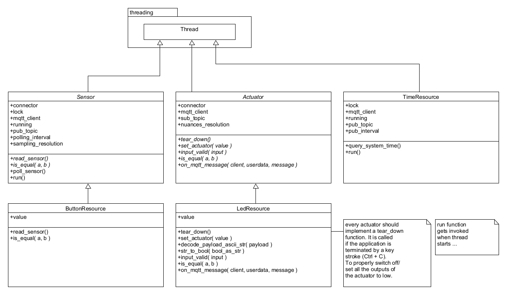
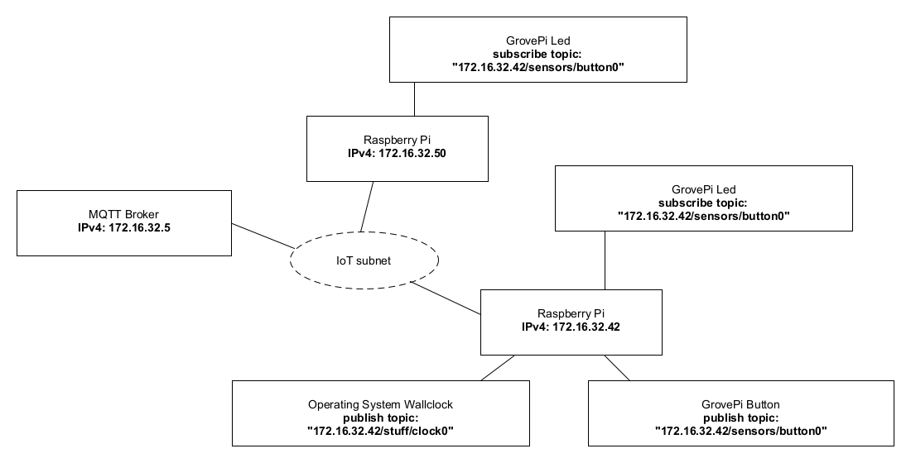
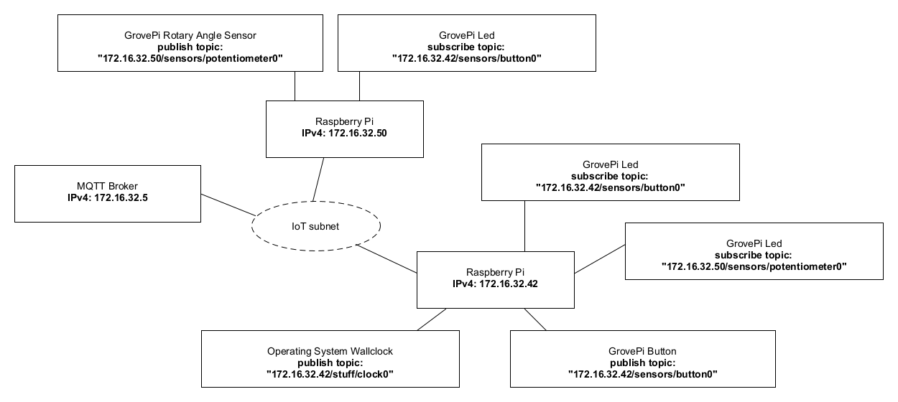

# 03 - MQTT

## 1. Introduction

This Lab will concentrate on MQTT (Message Queue Telemetry Transport). We setup a Broker on
the Raspberry Pi and play around with several clients and will have a closer look to the telemetry
data that we publish and subscribe. As last part of this laboratory the CoAP application from the
previous laboratory is going to be refactored to use the MQTT protocol instead of CoAP.

## 2. Learning Aims
There are no learning aims associated with this laboratory exercise.

## 3. Prerequisites

For this lab you need some parts from the previous lab, but basically the MQTT part will also work
if you start from scratch.
1. 1 Raspberry Pi device (with MAC address labelled around the ethernet port)  
1.1. [micro]SD card with at least 8 GB capacity  
1.2. Raspberry Pi Power supply
2. 1 GrovePi board
3. 1 GrovePi button
4. 1 GrovePi LED (colour indifferent)
5. 1 computer (your own laptop or a lab machine)  
5.1. Ethernet port connected to the IoT subnet
(Recommendation: WLAN switched off)  
5.2. SSH client installed (ssh, PuTTY, …)  
5.3. Wireshark (Network packet capturing software)  
5.4. Zip software (7-zip, WinZip, …)  
5.5. Editor of your choice for modifying the code base.

## 4. Getting started

### 4.1 A few words of introduction

This laboratory has been developed and tested on a Linux machine. In principal it should work fine
on Mac OS X and Windows too. Should you run into problems with the libraries or scripts provided
with this laboratory it is maybe worth trying to use a Linux VM on your laptops host system in
order to complete all the demanded tasks.

### 4.2 Preparation of the hardware

Connect the GrovePi board to your Raspberry Pi, then connect a GrovePi LED to the digital pin D4
and a GrovePi button to the digital pin D3. Make sure that the Raspberry Pi and your development
machine are connected to the IoT subnet. As mentioned earlier, it is a good idea to turn off all the
other network adapters (WLAN, …) on your development machine during the lab. If you are
connected to the IoT subnet you should have connectivity to the “internet”.


### 4.3 Installation of the required packages (already installed)

It is assumed that you have completed the previous laboratories. Due to that you should have a
[micro]SD card with a working Raspbian operating system on it with all the necessary packages
installed to interact with the GrovePi board and its resources.

Start up your Raspberry Pi and log in as pi user via a SSH client of your choice.

The following additional packages are used during this laboratory:

* netifaces package (system interface in python to access low level network subsystem
information)
  * Installation command:  
`sudo pip3 install netifaces (python3)`
* Mosquitto. MQTT broker which we install locally on the Raspberry Pi to send messages
during the first parts of this laboratory. It runs as a service.
  * Installation commands:  
`sudo apt-get update`  
`sudo apt-get install mosquitto`
    * Control the service: `sudo service mosquitto [ status | start | stop ]`
* Mosquitto-Clients. MQTT client to publish and subscribe MQTT messages
  * Installation command:  
`sudo apt-get install mosquitto-clients`
* Paho MQTT is a Python library which implements the MQTT protocol.
  * Installation command:  
  `sudo pip3 install paho-mqtt (python3)`


## 5. MQTT Basics

### 5.1 Publish and subscribe

First of all, we run the mosquitto broker.
* Open a terminal/console and type `mosquitto`. The output should show you the mosquitto
version number and some information about the opened socket for ipv4 and ipv6, if
available.
  * If you get an error message, be sure the broker does not run as a background task. (It
does work too, but you can't see the standard output with ease).
Type `sudo service mosquitto stop`, to stop the mosquitto daemon on your system.
* The broker is now up and listens on all your interfaces on port 1883.
* 
Now we are going to start a subscriber that receives every message (absolutely everything) thats
published to this broker. It works as a logging console that logs every data passed through the
broker, we do that only to see whats happening. It isn't mandatory and can be omitted if you feel
familiar with MQTT.

* Open another terminal, connect to your Raspberry Pi and type:
`mosquitto_sub -h 127.0.0.1 -p 1883 -t "#" -v`
  * -h: stands for host  
-p: port  
-t: topic  
-v: verbose, print the received topic  
#: a wildcard that show all subsequent levels of hierarchy in the topic string for more
information see the man pages by typing `man mosquitto` and search the man page with
**/WILDCARD TOPIC.**
* In the first terminal where the broker is running you should see a message:  
`“New client connected from \<ip> as \<name>”  `  
Now you are ready to use the broker.

#### 5.1.1 Mosquitto broker as a service

Later on if you want to have your own mosquitto broker on the Raspberry Pi you can run it as a
service. Control of the mosquitto service as follows:

Enable: `sudo systemctl enable mosquitto`  
Start: `sudo systemctl start mosquitto`  
Stop: `sudo systemctl stop mosquitto`  
Disable: `sudo systemctl disable mosquitto`  
Status: `sudo systemctl status mosquitto`  

#### 5.1.2 Go deeper, hack it!

To play around we use the Rasperry Pi with several terminals (SSH sessions). Each of this terminal
acts like a client, so you can simulate lots of clients on your Raspberry Pi with ease.

* Open a further Terminal, connect to your Raspberry Pi and publish some payload data,
probably a “hello world”, with the `mosquitto_pub` command to your localhost (127.0.0.1 or
the IP address of the Raspberry Pi's network interface). The log on the mosquitto broker
terminal should be altered and on the subscribing terminal you should see the topic and the
payload. E.g.:

  * Subscribing terminal:  
`mosquitto_sub -h 127.0.0.1 -p 1883 -t "#" -v`

  * Publishing terminal:  
`mosquitto_pub -h 127.0.0.1 -p 1883 -t "<IP-ADDRESS>/sensors/button0" -m
"Hello, World!"`

* Open another terminal session that subscribes just to your chosen topic.
  * Figure out how the topic wildcards work. (+ and #) Consult the mosquitto man pages
section “Wildcard Topic Subscriptions”

    * For example: Test the wildcards subscription. Subscribe to all machines HDD
temperatures (each HDD a machine contains):  
Exemplary publish commands:  
`mosquitto_pub -h 127.0.0.1 -p 1883 -m "75 degrees Celsius" -t
/machines/<IP-ADDRESS_1>/sensors/temperature/hdds/sdf`  
`mosquitto_pub -h 127.0.0.1 -p 1883 -m "75 degrees Celsius" -t
/machines/<IP-ADDRESS_1>/sensors/temperature/hdds/sdj`  
`mosquitto_pub -h 127.0.0.1 -p 1883 -m "75 degrees Celsius" -t
/machines/<IP-ADDRESS_2>/sensors/temperature/hdds/sdb`  
Elaborate a valid wildcard subscription and test it.

    * Further example: Get data of each sensor of all machines / IP addresses:  
Exemplary publish commands:  
`mosquitto_pub -h 127.0.0.1 -p 1883 -m "200 RPM" -t /machines/<IPADDRESS_
1>/sensors/fanspeed/socket0`  
`mosquitto_pub -h 127.0.0.1 -p 1883 -m "85 degrees Celsius" -t
/machines/<IP-ADDRESS_2>/sensors/temperature/cpus/cpu0`  
Elaborate a valid wildcard subscription and test it.

* Start many publishers and produce a bit of load with loops
  * `while true; do mosquitto_pub <arguments>; done`

  * measure/discover the CPU load of the broker (Rasperry Pi in our case)
and see whats happening.

* Publish and subscribe to a broker from your neighbors computer ...
  * Each student should start at least a publisher and a subscriber connecting to a common
broker. Try to chat via MQTT.  
Fact: These concepts are the fundamentals of the Facebook Messenger, which uses
MQTT to simply transmit telemetry data from client to client.

Now you should have enough experience with publishing and subscribing. But some of you would
ask about security. At the moment if you know the IP of a broker you can listen to everything. That
is, in fact, totally against privacy. We step into user authentication and topic access control lists in
the next chapter.

### 5.2 User Authentication and Access Control Lists

MQTT provides two types to secure your data. First is a more common user authentication where a
subscriber and a publisher has to login. The second concept is based on the topics. It simply allows
a user to publish or subscribes only to some predefined topics.

#### 5.2.1 It's all about users and their passwords

To start, we modify the broker configuration.

* Copy the original **mosquitto.conf** file to a folder of your choice.  
`cp /etc/mosquitto/mosquitto.conf /folder/of/your/choice`

* Open a further terminal, connect to your Raspberry Pi and open either the mosquitto.conf
man page `man mosquitto.conf` or the example configuration file:
`cp/usr/share/doc/mosquitto/examples/mosquitto.conf.gz ~`  
`gunzip mosquitto.conf.gz`  
`vim mosquitto.conf`  
Like this you have a reference to look after and have example configuration parameters.

* Open your copy of the configuration file in an editor. Find the chapter “Security” in the
**example configuration file**, get an overview and perform the following steps in your copy
of the configuration file:

  * Deny anonymous access
allow_anonymous false
  * Add a userlist in an additional file
    * Note: To store passwords in a plain text file is not save for production. Never do that.
In live applications, you need an authentication server that communicates with
mosquitto. If you like, setup the mosquitto-auth-plugin and configure it for your
computer. But this is really optional and not part of this lab.  
The reason for this “works like” authentication we use, is because of insufficient
time for this lab. But if you like, setup the auth-server and use it maybe in a future
lab (e.g.: your IoT project).  
A full description of the configuration file is at:
`/usr/share/doc/mosquitto/examples/mosquitto.conf.gz`  
Example:  
`password_file /home/pi/mosquitto_passwords`  
(line in your configuration file)  
Use the `mosquitto_passwd` utility to add the users to a given password file:  
`mosquitto_passwd -c /home/pi/mosquitto_passwords user1`  
`mosquitto_passwd /home/pi/mosquitto_passwords user2`  
`mosquitto_passwd /home/pi/mosquitto_passwords user3`  
  * Start the broker with:  
`sudo mosquitto -c /<path>/<to>/<your>/mosquitto.conf`
  * Try to publish and subscribe to the broker.
    * If you fall into trouble, try: `mosquitto_sub/pub –help`
    * Note that your global subscriber should now subscribe with a username and a
password, e.g:  
`mosquitto_sub -h 127.0.0.1 -p 1883 -t "#" -v -u user1 -P iotlab`  
`mosquitto_pub -h 127.0.0.1 -p 1883 -m "85 degrees Celsius" -t
/machines/<IP-ADDRESS>/sensors/temperature/cpus/cpu0 -u user2 -P
iotlab`  
  * Add a user for your neighbor and ask him to publish a cat joke to your broker.

#### 5.2.2 Authorized but insufficient access rights

Now we restrict the topics with access control lists (ACL). It is possible to allow just a few topics
for some users that will publish or subscribe.

ACL has several access mechanics. Simply allow just a few topics, allow some topics only
for given user or allow topics that matches a predefined pattern. We try all of them. (Howto
descriptions could be found in the example mosquitto configuration file
**[/usr/share/doc/mosquitto/examples]** under the security chapter).  
* Add the following rules to your ACL and test it. To do so, define some tests and fill out the
test table at the bottom of this page and test against your ACL.
  * The topic scheme is **/sensor/\<type>/data**. All authorized users are allowed to
subscribe to this topic.
  * One of your users in the userlist can publish and subscribe to the previous defined
scheme.
  * Another user of your userlist can publish only to **/sensor/temperature/data**.
  * All users are allowed to publish to **/sensor/\<username>/\<type>/data.**  
Use a pattern for this.
* Set the “allow_anonymous” flag to true and test again all your topic rules in your ACL. Are
they working correctly?

| Topic | User | Publish | Subscribe | Expectation | PASSED |
| -- | -- | -- | -- | -- | -- |
| /sensor/temperature/data | user1 | - | X | PASS | (y/n) | 
| /sensor/temperature/data | user1 | X | - | FAIL | (y/n) | 
| /sensor/temperature/data | user1 | - | X | PASS |  |
| /sensor/temperature/data | user2 | - | X | PASS |  |
| /sensor/temperature/data | user3 | - | X | PASS |  |
| /sensor/temperature/data | user117 | - | X | FAIL |  |
| /sensor/fanspeed/data | user1 | X | - | PASS |  |
| /sensor/fanspeed/data | user1 | - | X | PASS |  |
| /sensor/fanspeed/data | user2 | X | - | FAIL |  |
| /sensor/fanspeed/data | user2 | - | X | PASS |  |
| /sensor/fanspeed/data | user3 | X | - | FAIL |  |
| /sensor/fanspeed/data | user3 | - | X | PASS |  |
| /sensor/temperature/data | user2 | X | - | PASS |  |
| /sensor/fanspeed/data | user2 | X | - | FAIL |  |
| /sensor/user1/temperature/data | user1 | X | - | PASS |  |
| /sensor/user2/temperature/data | user2 | X | - | PASS |  |
| /sensor/user3/temperature/data | user3 | X | - | PASS |  |

## 6 The MQTT_thing application

In the previous laboratory, a simple CoAP application was built to let sensors and actuators
communicate with each other via CoAP. In this chapter, the aim is to build the same application
with the same functional behaviour, but the messaging between the devices should be realized with
the MQTT protocol.

The IoT subnet provides a MQTT broker which can be used by the MQTT_thing application. Of
course you can use the broker installation on your Raspberry Pi if you prefer. When working on
the laboratory at your site/infrastructure, then you must use the broker on your Raspberry Pi.
The broker from the ZHAW IoT laboratory infrastructure is not available from outside of the
laboratory rooms.

### 6.1 MQTT broker

A MQTT broker should be reachable from within the IoT subnet under the IP address:
**172.16.32.5**  

The configuration of the broker is by default, so no restrictions or missing permissions are set.
Every client can connect. Be sure to choose a unique client-id to connect, otherwise the broker gets
confused.

Your client can publish and/or subscribe to every possible topic.

### 6.2 Upload and test the provided code template

Upload the archive that contains the code template (**MQTT_thing-0.3-dbg.zip**) which is provided
with this documentation to your Raspberry Pi and unzip it.

After that you shoud see a folder named **MQTT_thing**. Change into the **MQTT_thing/src/** directory,
where the following files can be found:

```bash
-rw-r--r-- 1 pi pi 2812 Oct 17 03:07 Actuator.py
-rw-r--r-- 1 pi pi 2858 Oct 17 03:07 ButtonResource.py
-rw-r--r-- 1 pi pi 2858 Oct 17 03:07 grove_pi_interface.py
-rw-r--r-- 1 pi pi 3800 Oct 17 03:07 LedResource.py
-rw-r--r-- 1 pi pi 1284 Oct 17 03:07 log.py
-rw-r--r-- 1 pi pi 2527 Oct 17 03:07 mqttconfig.py
-rwxr-xr-x 1 pi pi 5273 Oct 17 03:07 mqttthing.py
-rw-r--r-- 1 pi pi 2709 Oct 17 03:07 Sensor.py
-rw-r--r-- 1 pi pi 2820 Oct 17 03:07 TimeResource.py
-rw-r--r-- 1 pi pi 1616 Oct 17 03:07 tools.py
```

Start the program: `python3 ./mqttthing.py`

The application uses a python logger which is configured to be very verbose since the application is
in a development state. Do not be concerned about if your console gets spammed with log messages
during the application runs.

To test the functionality of the application it is sufficient for now to test if the connected LED turns
on as long as the connected button is pressed and switches off again if the button is released.

The application has also implemented a clock resource. This resource publishes the current system
time to a MQTT broker. To check this, you can open a terminal, connect to your Raspberry Pi and
subscribe to this topic:

`mosquitto_sub -h <BROKER-IP> -t "<RaspberryPi-IP>/stuff/clock0"`

The program can be terminated by pressing **Ctrl + C**.

### 6.3 Study the architecture

The application is entirely written in Python (version 3.4.2). The implementation of MQTT is
provided by the paho-mqtt package. In general the implementation of MQTT_thing uses object
orientation, but it was decided to stay in a pragmatic scope and not to exaggerate the object
orientation.

#### 6.3.1 Basic concept

The MQTT_thing application consists of a main module, **mqttthing**, which represents a MQTT
client. The client itself has resources (sensors and actuators) which can be reached via an
appropriate MQTT topic.

The basic MQTT_thing template consists of a MQTT client with the following resources:
* **button0**: GrovePi Button
* **led0**: GrovePi LED
* **clock0**: Resource which gets the operating system's time and serves it to the requester.

The resources have the following class structure:



This class diagram shows only the most important functions / instance variables at current classes.

As you can see this application uses pythons pseudo threads to manage parallel tasks instead of
coroutines which were used to implement the CoAP_thing application. The reason for this is mainly
because of the paho-mqtt package, which is also based on python threads.

Study and try to understand the code. Be aware of the multithreading mechanisms like locks,
running flags, etc.


#### 6.3.2 Network situation


The IP addresses are only exemplary!

The CoAP_thing application implemented a classical approach of the observer pattern. A sensor
was polled and if its state changed, all the observers of the sensor were notified. The MQTT_thing
application is completely different:

**Sensors publish their state changes on a specific topic, via MQTT broker.**

**Actuators subscribe on the topic that they are interested in, via MQTT broker.**


### 6.4 Expand the application

Now after getting a first glance, the basic concept of the MQTT_thing application should be
understood. For this task at least 2 Raspberry Pi's are needed. Therefore you should work in goups
of two or three.

To start and see if the MQTT_thing application also works distributed over a network, it is
recommended that a very simple network scenario is implemented first.

#### 6.4.1 Scenario: 2 RPi's, 1 button, 2 LED's

Try to extend the application to achieve the following situation:



The IP addresses are only exemplary!

If everything was adjusted the right way, the LED's on both Raspberry Pi's should light up when the
button is pressed and switch off when the button is released again.

#### 6.4.2 Scenario: 2 RPi's, 1 button, 1 rotary angle sensor, 3 LED's

It is not mandatory to implement exactly this scenario. This is just a proposal. You are free to
choose and implement every sensor/actuator that is available in the laboratory. The only condition is
that your distributed application is somewhat more sophisticated than the one in the previous
scenario.



The IP addresses are only exemplary!

Additional to the previos scenario a rotary angle sensor and another LED were connected to the
GrovePi boards here. The rotary angle sensor should dim the LED. (Remember the first laboratory,
example GrovePi Python scripts.)

But now the sensor values have to be transferred over the network. Try to implement the resources
and think about how this could be done and which values have to be transmitted.

## 7 Grading

3 points maximum will be awarded for completion of the exercises.

